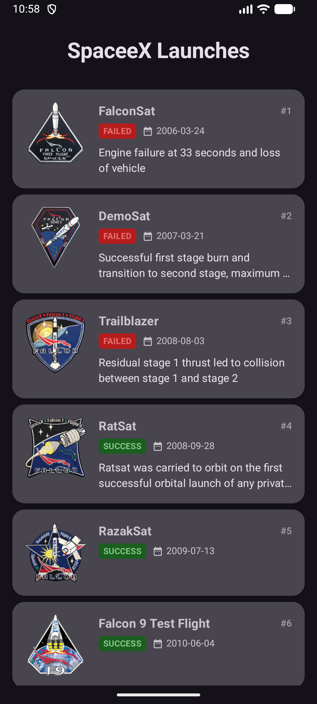
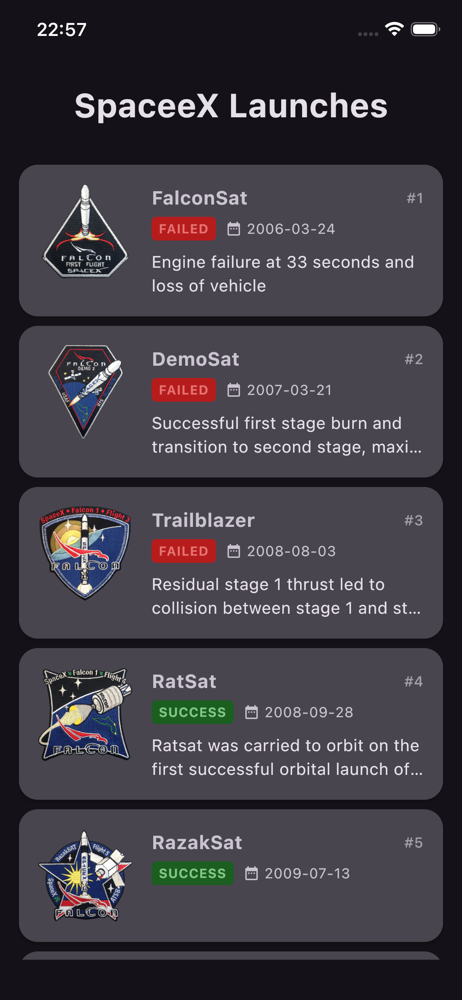
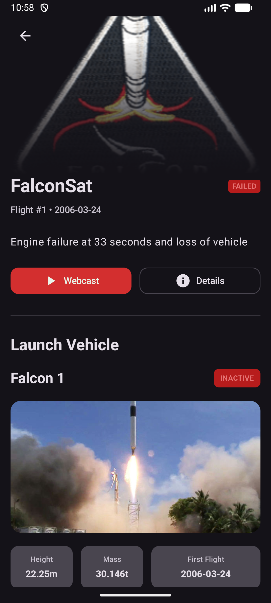
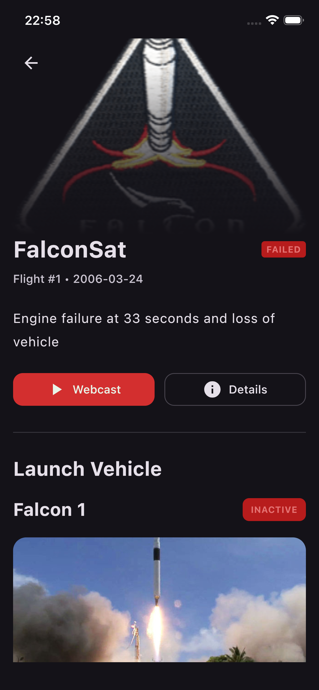
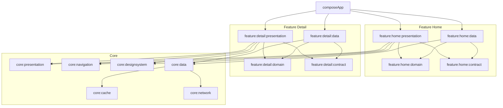

# SpaceX Explorer - KMP Case Study

## 1. Executive Summary
SpaceeX is a production-grade Kotlin Multiplatform (KMP) application designed to demonstrate scalable, cross-platform mobile architecture. By leveraging Compose Multiplatform, the project achieves 100% UI code sharing across Android and iOS while maintaining native performance and platform-specific capabilities where necessary. This case study highlights a highly modularized Clean Architecture, Unidirectional Data Flow, and an offline-first data strategy.

## 2. Media Showcase

| Android Home | iOS Home |
| :---: | :---: |
|  |  |

| Android Detail | iOS Detail |
| :---: | :---: |
|  |  |

## 3. Tech Stack

- **Compose Multiplatform:** Enables 100% UI and presentation logic sharing across Android and iOS with native rendering.
- **Ktor:** A high-performance, asynchronous HTTP client perfectly suited for multiplatform JSON serialization and networking.
- **Room (KMP):** Provides robust, offline-first local caching backed by SQLite uniformly across all compilation targets.
- **Koin:** A lightweight, pragmatic dependency injection framework that resolves the multiplatform graph without compilation boilerplate.
- **Coroutines & Flow:** Drives non-blocking concurrency, asynchronous mapping, and reactive stream handling (UDF) consistently across platforms.
- **Detekt:** Enforces strict static code analysis and consistent formatting to maintain a reliable, scalable codebase.

## 4. Architecture & Module Graph

The application strictly adheres to **Clean Architecture** and the **MVVM / Unidirectional Data Flow (UDF)** presentation pattern. To maximize build cache efficiency and enforce separation of concerns, the project is heavily modularized into `:core` and `:feature` modules. 

- **Domain Layer:** Pure Kotlin modules containing business rules, models, and use cases.
- **Data Layer:** Implements repository abstractions, orchestrating network fetching and local persistence.
- **Presentation Layer:** Manages UI state via `ViewModel` and exposes immutable `StateFlow` to the Compose UI.
- **Contract Layer:** Contains feature-specific interfaces to decouple implementations and avoid tight coupling between feature data and presentation layers.

## 5. Key Technical Decisions
- **Clean Architecture & Multi-Module Structure:** The project strictly adopts Clean Architecture Principles, dividing responsibilities into distinct `Domain`, `Data`, and `Presentation` layers. A highly modularized setup (`:core` and `:feature` modules) enforces strict dependency rules, optimizes build times, and improves team scalability.
- **Compose Multiplatform Over SwiftUI:** Compose Multiplatform was aggressively chosen to achieve 100% UI code sharing. Given the current maturity and stellar rendering performance of Compose on iOS, managing separate SwiftUI views was deemed unnecessary.
- **Modern Librarires (Next-Gen Stack):** Instead of relying on legacy multiplatform navigation solutions (e.g., Voyager), the project employs a bespoke, modern stack.
- **State-Driven Navigation:** The routing architecture isolates navigation logic directly within the `ViewModel`. By emitting navigation events via a Unidirectional Data Flow stream, the Compose UI remains entirely declarative and devoid of complex navigation side-effects.
- **Offline-First Launch Data:** Network resiliency was prioritized by implementing a robust offline-first caching mechanism for SpaceX launch data. This completely masks long API response times, serving cached data instantly via Room while seamlessly syncing remote data in the background.

## 6. Future Plans
While the current architecture serves as a robust foundation, several enhancements are planned on the roadmap:
- **Multi-Language Localization:** Integrating a dynamic string management system to support multiple locales, provided the backend API can support localized payloads.
- **Embedded YouTube Player:** Building native Expect/Actual bindings to support robust, in-line YouTube playback for SpaceX launch broadcast streams, eliminating the need to throw users out into a browser.
- **Smarter Cache Invalidation:** Optimizing the offline-first repository to validate cache freshness via highly-efficient timestamp checks, reducing redundant network requests and battery drain.
- **Extended Launch Telemetry:** Expanding the domain models to parse, cache, and display richer launch statistics, including Crew manifests, payload details, and booster recovery histories.

## 7. How to Run

### Android
1. Open the project in **Android Studio (Ladybug or later)** or **Fleet**.
2. Select the `composeApp` (or `androidApp`) run configuration.
3. Target an Android Emulator (API 24+) or a physical device and hit **Run**.

### iOS
1. Ensure **Xcode** and the **Kotlin Multiplatform Mobile** plugin are installed.
2. Allow Gradle to perform the initial iOS framework sync.
3. Open `iosApp/iosApp.xcworkspace` in Xcode (or select the `iosApp` run configuration in Android Studio/Fleet).
4. Select an iOS Simulator (e.g., iPhone 16 Pro) and hit **Run**.
